# Digital Forensic Evidence Vault and Case Management System

**Author:** Boakye Alfred Osei
**Index Number:** FCM 41.018.099.23
**Course:** CY376 — Network Monitoring, Security and Auditing

## Overview

The **Digital Forensic Evidence Vault and Case Management System** is an enterprise-grade platform built using PHP and the Laravel framework. It provides digital forensics investigators, incident responders, and security administrators with a secure environment to manage forensic cases, store digital evidence, maintain strict chain-of-custody tracking, and perform integrity auditing.

The system ensures that digital evidence remains tamper-evident and legally defensible throughout its lifecycle.

---

## Core Features

- **Forensic Case Management**: Create, assign, update, and archive investigative cases with detailed metadata, priorities, status workflows, and team assignments.
- **Evidence Management**: Secure upload and cataloging of digital evidence with automated cryptographic hashing (SHA-256 / MD5) calculated upon upload to ensure data integrity.
- **Chain of Custody (CoC) Tracking**: Verifiable chain-of-custody transfer logging. Transfers must be accepted or rejected by recipient custodians, preventing unauthorized evidence movement.
- **Audit Logging and System Scans**: Automatic recording of critical events (file access, user authentication, evidence transfers, administrative actions). Includes system integrity scanner tools and CSV audit report exports.
- **Reporting Engine**: Automated generation of official Chain of Custody reports and comprehensive Final Case Reports.
- **Batch Export**: Export case evidence packages as encrypted/structured batch ZIP archives for court presentation or external analysis.
- **Security and Access Control**: Role-based access control (RBAC), multi-factor authentication (2FA) support, and administrative security settings.

---

## Prerequisites

- **PHP**: ^8.2
- **Composer**: Dependency manager for PHP
- **Node.js & NPM**: Asset compilation
- **Database**: MySQL, PostgreSQL, or SQLite
- **Web Server**: Apache / Nginx / XAMPP

---

## Installation and Setup

1. **Clone the Repository**:
   ```bash
   git clone <repository-url>
   cd forensic_toolkit
   ```

2. **Install PHP and Node Dependencies**:
   ```bash
   composer install
   npm install
   ```

3. **Configure Environment File**:
   Copy `.env.example` to `.env` and set your configuration details.
   ```bash
   cp .env.example .env
   ```
   Update database credentials and storage pathways in `.env`.

4. **Generate Application Key**:
   ```bash
   php artisan key:generate
   ```

5. **Run Database Migrations and Seeders**:
   ```bash
   php artisan migrate --seed
   ```

6. **Compile Frontend Assets**:
   ```bash
   npm run dev
   ```

7. **Serve Application**:
   ```bash
   php artisan serve
   ```

---

## Git Workflow and Branching Strategy

To maintain codebase integrity, code quality, and proper audit history, all contributions must follow a structured feature-branch workflow.

### Primary Branches

- `main`: Represents production-ready code. Direct commits to `main` are strictly prohibited.

### Development Workflow

1. **Fetch Latest Main Branch**:
   Always start by pulling the latest changes from `main`.
   ```bash
   git checkout main
   git pull origin main
   ```

2. **Create a Feature or Fix Branch**:
   Name your branch according to the type of work being performed:
   - `feature/feature-name` (e.g., `feature/evidence-hash-verification`)
   - `fix/bug-description` (e.g., `fix/coc-pdf-generation`)
   - `chore/task-name` (e.g., `chore/update-readme`)

   ```bash
   git checkout -b feature/your-feature-name
   ```

3. **Develop and Commit Changes**:
   Make clear, atomic commits with descriptive commit messages following standard conventions.
   ```bash
   git add .
   git commit -m "feat: add hash verification endpoint for evidence items"
   ```

4. **Run Verification and Tests**:
   Ensure all static analysis checks, code formatting rules, and automated tests pass before pushing.
   ```bash
   vendor/bin/phpunit
   ```

5. **Push Branch to Remote Repository**:
   ```bash
   git push -u origin feature/your-feature-name
   ```

6. **Submit a Pull Request (PR)**:
   - Open a Pull Request from your feature branch targeting `main`.
   - Provide a clear summary of changes, motivation, and test steps in the PR description.
   - Assign relevant team members for code review.
   - Merge into `main` only after receiving necessary approvals and ensuring continuous integration checks pass.

---

## Screenshots

Key screenshots of the system in use, from [`docs/screenshots`](docs/screenshots). These mirror the figures captioned in the written report.

**Sign In**
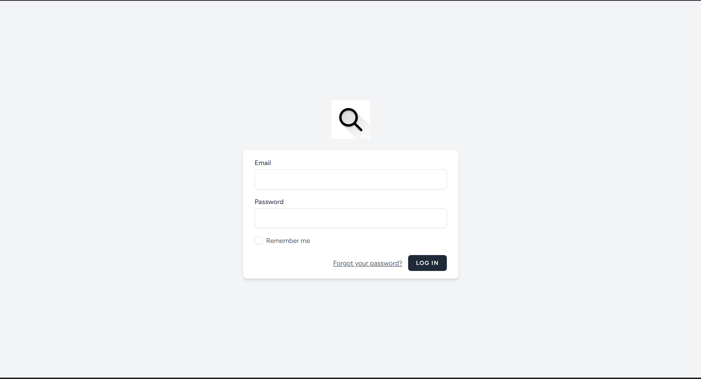

**Two-Factor Authentication**
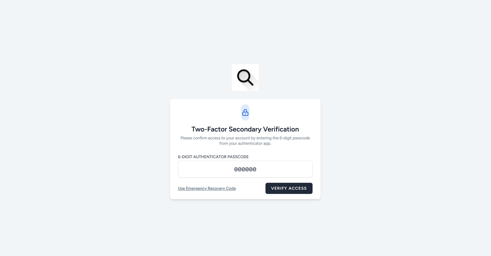

**Dashboard — Case Status, Evidence Classification, and Audit Velocity charts**
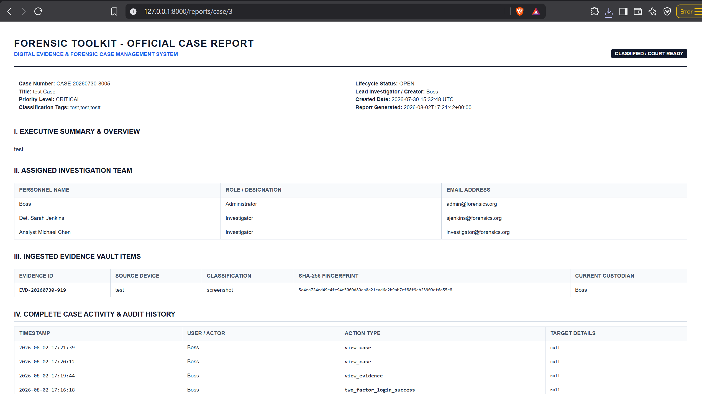

**Case Repository**
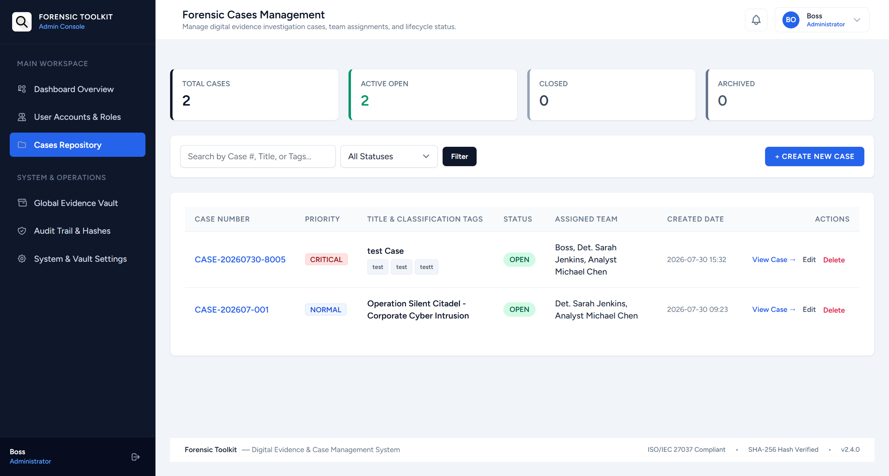

**Case Details — timeline and event map**
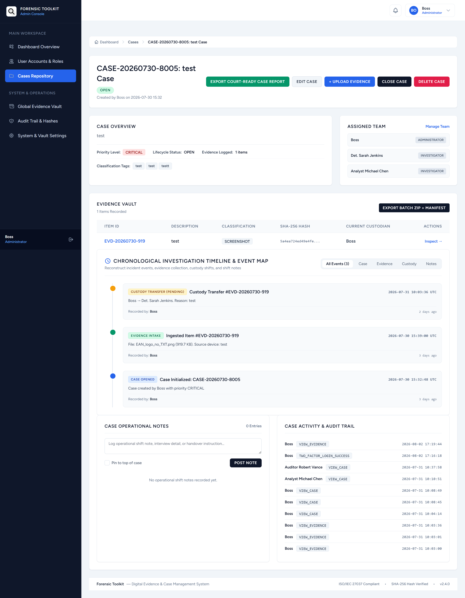

**Evidence Vault**
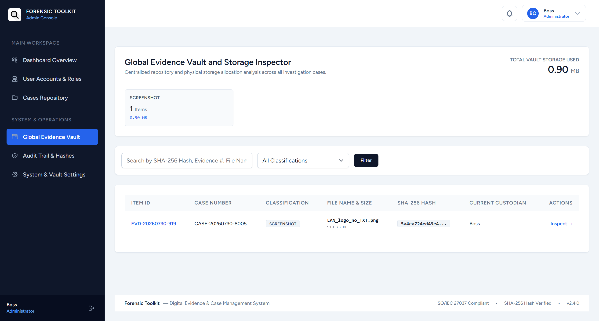

**Evidence Inspection — hex viewer and EXIF metadata**
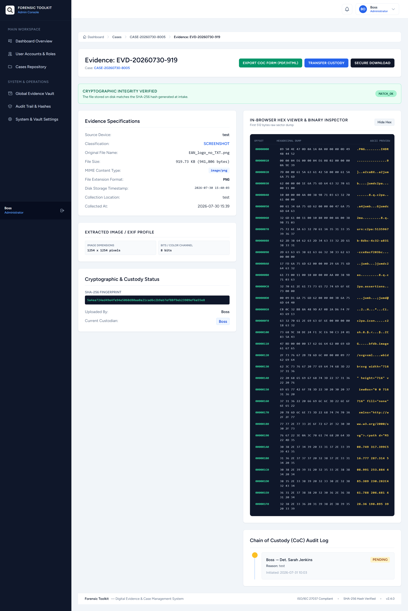

**Audit Log — tamper-evident hash-chained trail**
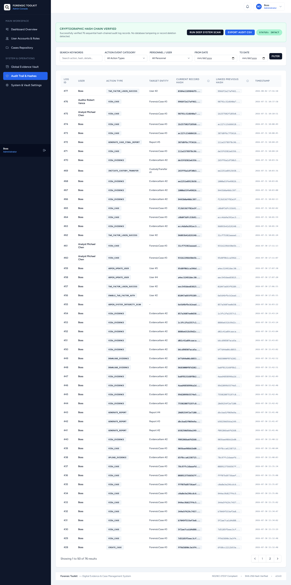

**Admin Dashboard**
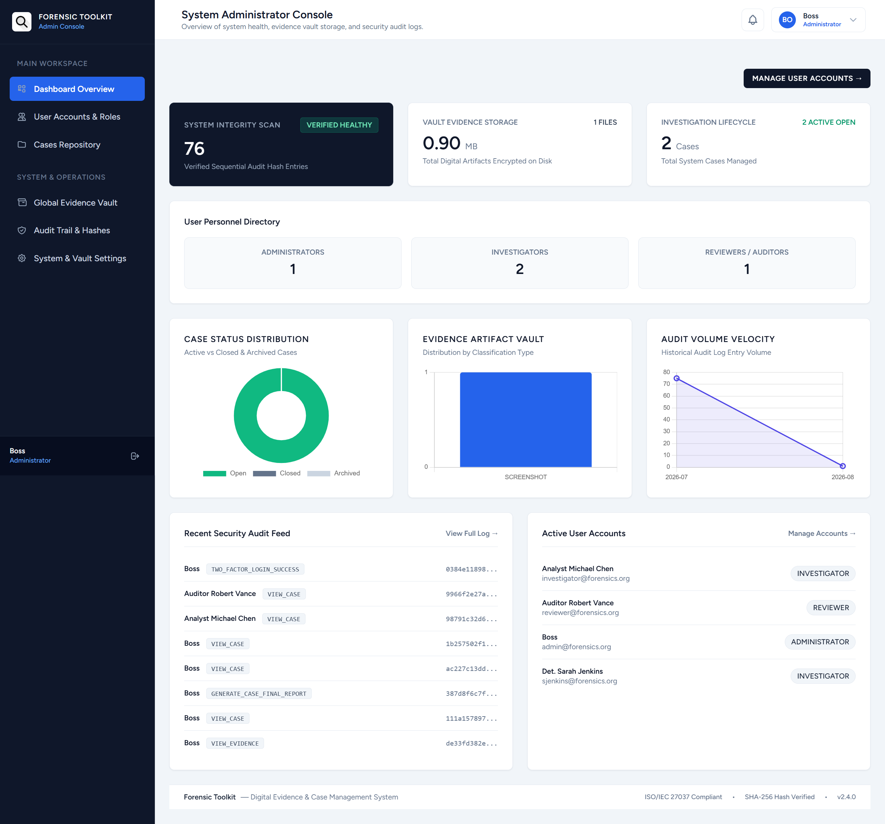

**Role Management**
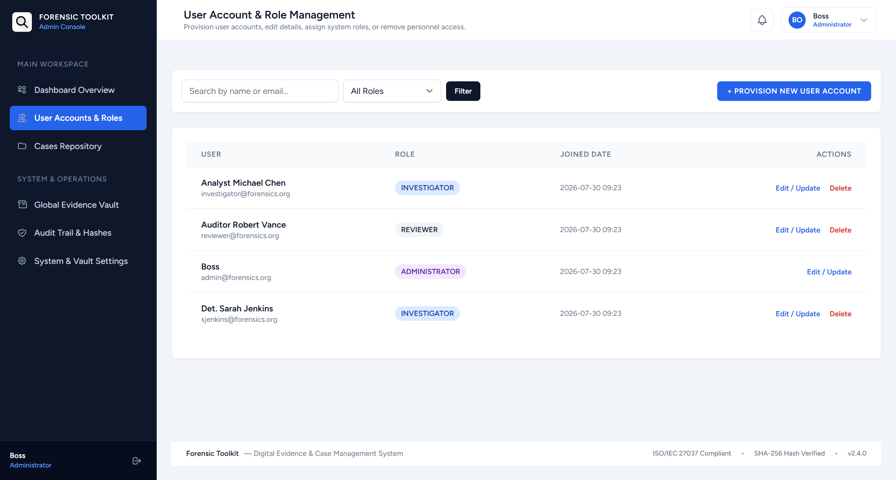

**Profile Page**
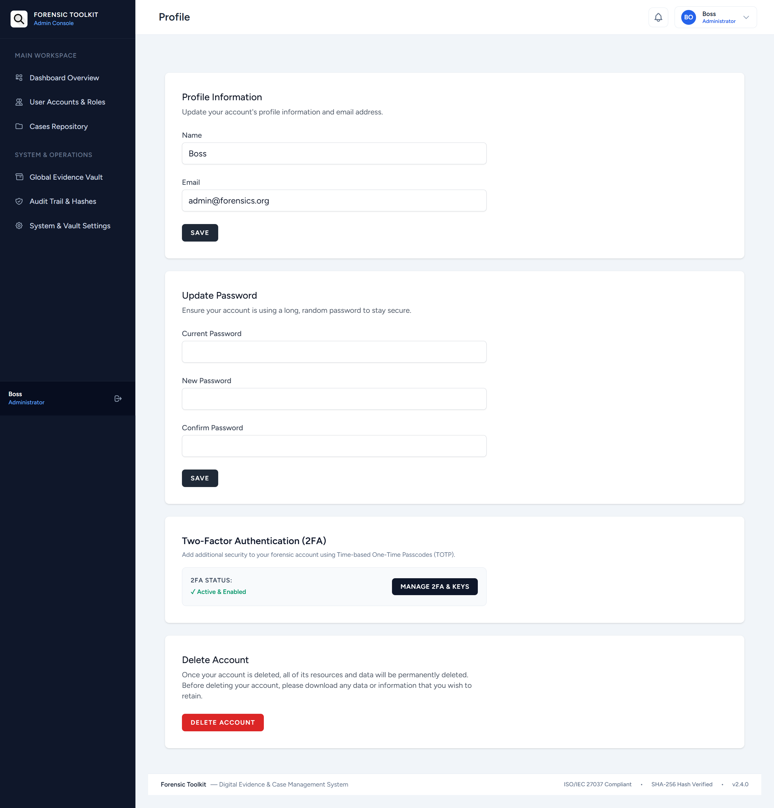

---

## Testing and Quality Assurance

Run the PHPUnit test suite to verify application functionality:

```bash
php artisan test
```

---

## License

This project is open-source software licensed under the MIT license.
